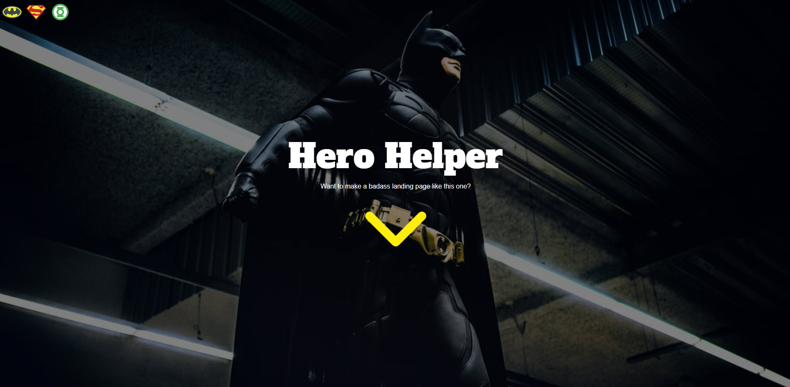
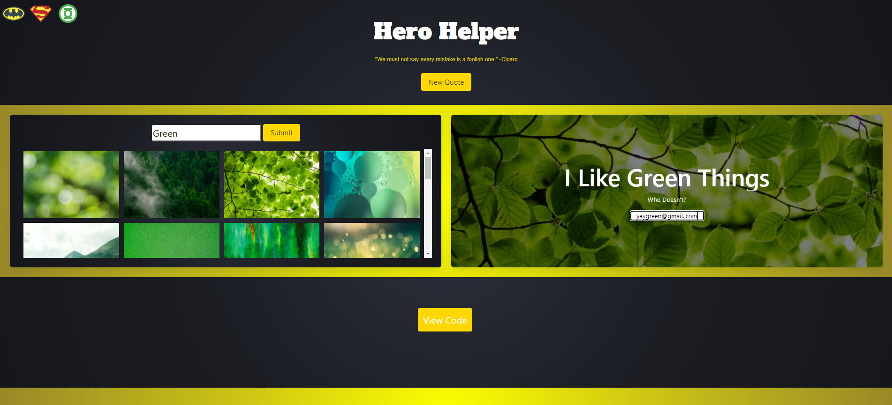
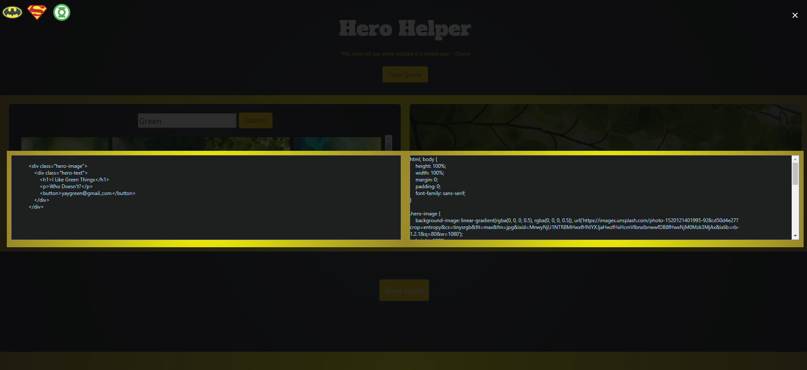

# Hero Generator

# Description

In this group project we created an application where a user can search for an image and use it to create a sample of a Hero image with text.  
They will also be presented with HTML and CSS code for the Hero image and wording they selected that they can then use in their own code. 

# Link to live site

https://lindamart.github.io/Interactive_FrontEnd_HeroApp/

# Wireframe for the website

## Desktop

## Mobile

# Application Preview

# Acceptance Criteria

As a user I want to be able to search for an image and have the ability to add text to a preview so that I can be presented with code that I can then copy and use in my HTML and CSS 

When the user opens the app they have an option to change the look of the page by selecting different theme options

Once selected the them will be saved until another theme is selected

When hitting the arrow down button on the application the user will be presented with an instruction box that gives them details about the app and how to use it that must be closed to use the app

The user will be presented with a quote of the day in the header section.

When the user clicks the get new quote button a new quote appears.

The user will have the option to enter a keyword in the image search bar and can then press submit to be presented with a group of images that matches their keyword.

When the user taps on one of the images then their selection will then be shown in the preview model box 

When the image is presented in the preview box the user has the option to add text to the preview

The user can then press view code and the code will be presented to them in both HTML & CSS code

The user can then click on the code to copy the  HTML & CSS code for the final image and text preview selected 

The user can then click back on the main screen and they can then start a new search if they wish to start over again

# Credits

W3 Schools: https://www.w3schools.com/

MDN Web Docs: https://developer.mozilla.org/en-US

Unsplash Images API Docs: https://unsplash.com/developers

Type.fit Quotes API Docs: https://type.fit/api/quotes

Icons8 Docs: https://icons8.com/

Bulma: https://bulma.io/

JQuery: https://jquery.com/

Google Fonts: https://fonts.google.com/

Clipboardjs Docs: https://clipboardjs.com/

Animate.css: https://animate.style/

