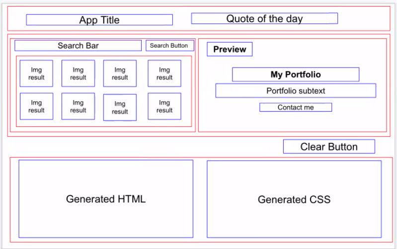
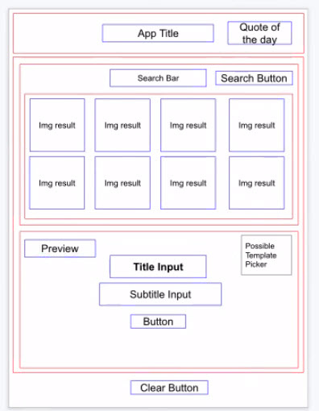

# Title

Hero Generator

# Description

As a user I want to be able to search for an image and have the ability to manipulate a preview so that I can be presented with code that I can then copy and use in my HTML and CSS 

# APIs

We will use the Flickr API as well as a quote of the day API (Zen Quotes or Quotes REST)

# Wireframe or Design for the website

Desktop

Mobile

# List of Tasks or Acceptance Criteria

When the user opens the app a quote of the day appears in the header section.

When the user clicks the get new quote button a new quote appears.

When the user gives a keyword in the search bar and presses submit they are presented with a group of images from flickr that matches their keyword.

When the user selects one of the images then their selection is shown in the preview model and automatically updates the CSS code

The user has the ability to enter text to customize the content on their hero preview which automatically updates the HTML code

When the user clicks the clear button, all previously populated user info is reset

# First Task for each member

Jeremiah: Connect the preview section with the live HTML and CSS code output sections

Linda: Hit Flickr API endpoint with a test search query or actual user search input

Kieran: Establish layout and initial styling

Luis: Establish layout and initial styling

# What does the functioning prototype have in features for the first week?

By Saturday 10/9 our goals are as follows:

* Hit the Flickr API endpoint and fetch an array of photos that match a query string (whether that be directly from the user input or from a test query string)
* Connect the preview section with the live HTML and CSS code output sections
* Establish a layout structure and begin styling